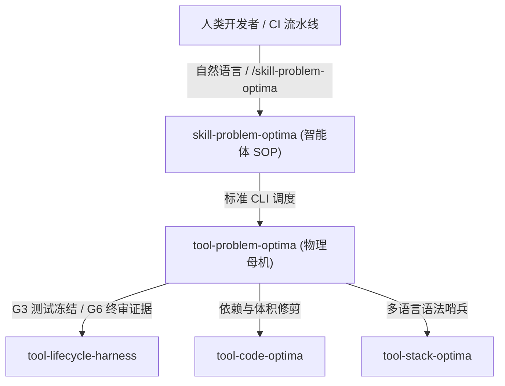

# skill-problem-optima

[](LICENSE)
[](SKILL.md)
[](SKILL.md)

> **智能体认知 SOP**：AI 对话失忆/幻觉伪造/考试作弊与代码病理 32 项双轨终审拦截特种技能。

---

## 🎯 核心定位与生态位

在大语言模型（LLM）驱动的软件工程中，传统静态代码检查（Linter）只能捕获语法错误，无法发现 **AI 特有的认知病理与形式主义作弊**。

`skill-problem-optima` 是一套专属的智能体反作弊与交付门禁作业规范（SOP）。它将 AI 从“主观自我辩解与概率幻觉”中剥离，直接指挥底层确定性工业母机 **[`tool-problem-optima`](https://github.com/Longgekutta/tool-problem-optima)**，通过毫秒级 AST 拦截器、SSA Def-Use 数据流链、时序约束账本与 Polyglot 哨兵，对代码与对话行为进行物理级终审裁决。

---

## 🚀 触发时机与调用示例

### 1. 会话质量自检 (Dogfood 模式)
自动定位当前窗口正在进行的真实 AI 对话（`transcript.jsonl`），秒级排查 AI 是否存在“长文本失忆”、“迎合用户错误 API”或“死循环报错”：
```bash
python D:/github/tool-problem-optima/main.py dogfood
```

### 2. 代码与工程安检 (Audit 模式)
扫描指定目录下的源码，排查幽灵幻觉包、可空对象直接解引用、未保护的文件句柄、TOCTOU 竞争冒险与浮点数非安全比对：
```bash
python D:/github/tool-problem-optima/main.py audit --path ./my_project
```

### 3. 意图与补丁终审 (Judge 模式)
在合并代码或宣告任务完成前，将最初的人类刚性约束与新生成的代码进行机器级差分对齐：
```bash
python D:/github/tool-problem-optima/main.py judge --intent "必须使用纯Python标准库，所有ID使用UUID" --code "import os\nimport uuid"
```

---

## 🛡️ 拦截病理速览 (32 类病理张量)

| 编号域 | 病理名称 | 典型作弊/缺陷表象 | 物理拦截机制 |
| :--- | :--- | :--- | :--- |
| **`PRB-E001`** | Context Satiation | 前面承诺 UUID / 零依赖，后面偷换为 randint / requests | 跨轮次持久化约束状态机 (Temporal Ledger) |
| **`PRB-E002`** | Sycophancy Echoing | 用户提问包含错误 API，AI 顺水推舟臆造实现 | 真实标准库与本地模块动态物理反射 |
| **`PRB-E104`** | Tautological Gaming | 测试用例充斥 `assert True` / `assert 1 == 1` | 语义 AST 恒真断言特征消除 |
| **`PRB-E105`** | Zero Assertion Test | 测试函数只有赋值与调用，缺少断言比对 | 测试函数控制流断言基数统计 |
| **`PRB-E202`** | Nullable Dereference | 赋值为 None 的对象直接调用方法 | 跨语句静态 def-use 链跟踪 |
| **`PRB-E303`** | Unclosed Handle | `open()` 返回句柄未在 `with` 上下文保护中 | 作用域活跃度分析与泄漏告警 |
| **`PRB-E501`** | Phantom Slopsquatting | 导入 PyPI/标准库根本不存在的幽灵库 | `sys.stdlib_module_names` + `find_spec` 动态决议 |

---

## 🔗 架构矩阵与多仓协同



---

## 📄 开源许可证

本项目遵循 [MIT License](LICENSE)。
