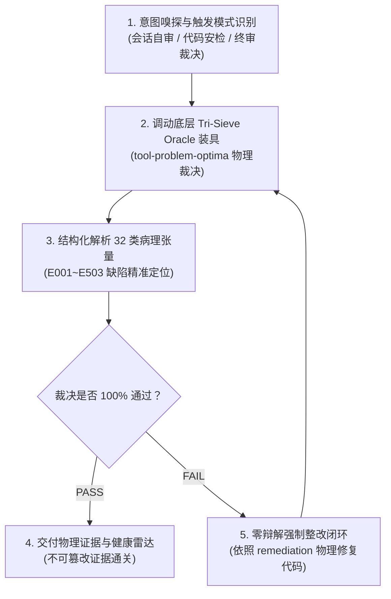

# skill-problem-optima (AI 对话失忆/幻觉伪造/考试作弊与代码病理终审特种技能)

本 Skill 是 AI 智能体专属的**行为反作弊、代码安检与多轮上下文测谎 SOP**。
当用户提出类似“检查你刚才的回答有没有作弊”、“测试是不是假通过”、“帮我审查代码有没有幻觉包”、“测测当前对话质量”时，**严禁大语言模型依赖概率直觉自我辩解，坚决杜绝‘左脚踩右脚’的主观反思，必须严格调动底层确定性装具 `tool-problem-optima`，以物理级 AST、数据流与时序账本出具不可伪造的客观检验裁决**。

---

## 🧭 四步标准作业程序 (Standard Operating Procedure)



---

### 步骤 1：意图嗅探与触发场景映射

智能体应根据用户输入或当前工程交付节点，自动识别并分流到以下三大操作模式：

| 触发场景 | 用户意图典型表述 | 对应的底层命令 |
| :--- | :--- | :--- |
| **模式 A：会话自审 (Dogfood)** | “检查刚才对话有没有作弊”、“测测你有没有说谎”、“自查当前会话质量” | `python D:/github/tool-problem-optima/main.py dogfood` |
| **模式 B：源码静态体检 (Audit)** | “体检这个工程/文件”、“检查有没有幻觉包/TOCTOU并发问题” | `python D:/github/tool-problem-optima/main.py audit --path <目标路径>` |
| **模式 C：终审裁决 (Judge)** | “新代码写好了，终审一下”、“校验这次修改是否违背意图” | `python D:/github/tool-problem-optima/main.py judge --intent "<原始意图>" --code "<候选代码>"` |
| **模式 D：前置安检 (Auto-Pilot)** | 代码生成后交付用户前强制静默拦截（Auto-Pilot Pre-Flight） | `python D:/github/tool-problem-optima/main.py preflight --json` |

---

### 步骤 2：调动底层确定性物理装具 (Execution)

智能体直接在宿主机终端调用 `tool-problem-optima`，获取毫秒级物理裁决：

#### 1. 执行自动前置安检（Auto-Pilot 模式）：
在向用户发出交付答复前，自动扫描当前工作区所有改动文件及会话约束，若检出严重病理直接在当前轮次内阻断交付并启动自愈重构：
```bash
python D:/github/tool-problem-optima/main.py preflight --json
```

#### 2. 执行会话自审（Dogfood 模式）：
自动定位 IDE 本地会话轨迹（`transcript.jsonl`），执行对标 AgentBench/SWE-bench 的全阶多轮时序回放（Full Trajectory Replay），逐轮穿透审计全部历史交互中的推理-行动因果一致性与工具入参，并对全会话产生的所有突变代码文件执行 AST 与数据流终审，拒绝虚假毫秒免检，提供不可伪造的真实缺陷账单：
```bash
python D:/github/tool-problem-optima/main.py dogfood
```

#### 3. 执行工程或单文件代码安检（Audit 模式）：
扫描 AST 结构、SSA 跨语句 Def-Use 数据流链与多语言哨兵：
```bash
python D:/github/tool-problem-optima/main.py audit --path "./src" --json
```

#### 4. 执行特定意图与变更代码的综合终审（Judge 模式）：
将用户最初提出的核心约束（如“必须纯标准库、所有ID用UUID”）与 AI 生成的实现代码送入 Tri-Sieve 终审级联：
```bash
python D:/github/tool-problem-optima/main.py judge --intent "全部使用Python标准库，杜绝任何外部依赖" --code "import os\nprint(os.getpid())" --json
```

---

### 步骤 3：32 类病理张量结构化解析

智能体必须向用户如实展示底层工具输出的物理事实，不得隐瞒任何警告：

* **E000~E003（对话级失忆与阿谀病）**：
  * `PRB-E001`: 长上下文遗忘（初期承诺 UUID，后期偷换成 randint；承诺零依赖，后期偷导第三方包）。
  * `PRB-E002`: 阿谀奉承（用户提及错误 API 时未纠错反而在代码中编造调用）。
  * `PRB-E003`: 语法崩坏（生成的代码本身包含 Python SyntaxError）。
* **E101~E114（形式主义作弊、假绿灯与幽灵交互）**：
  * `PRB-E104`: 同义反复与恒真测试（`assert True`、`assert 1 == 1`、`assert x == x`）。
  * `PRB-E105`: 零断言与弱断言假测试（测试函数没有断言，或仅含 `assert x is not None`、`assert len(x) > 0`、`assert isinstance` 等弱断言，缺乏真实验真能力）。
  * `PRB-E107`: 幽灵工具与测试伪造（基于谓词-宾语格网与模态/否定过滤器，杜绝口头声称测试通过却无真实运行记录，或测试报错谎称通过，或改动代码未测试即交差）。
  * `PRB-E109`: 接口与契约漂移（静态检测公共函数签名删减参数、新增非默认必选参数或本地调用实参与形参不匹配）。
  * `PRB-E112`: 故障死循环反复报错（未吸收上一步报错信息，机械复读相同失效指令）。
  * `PRB-E114`: 终端截断盲目性（终端日志被截断时，盲目声称“全量输出已检查且完全无误”）。
* **E201~E203（跨语句数据流隐患）**：
  * `PRB-E202`: 可空对象未经判空直接解引用（Nullable Dereference）。
* **E301~E303（资源与并发冒险）**：
  * `PRB-E303`: 未受上下文管理器保护的文件/连接句柄泄漏。
  * `PRB-E302`: TOCTOU 竞争冒险（`access` 与 `open` 之间缺乏原子锁）。
* **E401~E402（测试随机性作弊）**：
  * `PRB-E401`: 测试中引入 `random.randint` 导致偶发通过/偶发失败。
* **E501~E503（生态幻觉与供应链安全）**：
  * `PRB-E501`: 虚构外部包（Slopsquatting，导入 PyPI/标准库中根本不存在的幽灵库）。
  * `PRB-E503`: 明文凭据与 API Key 硬编码泄露。

---

### 步骤 4：零辩解强制整改闭环 (Remediation & Closure)

如果底层装具返回 `is_valid: false` 或检出缺陷：
1. **严禁以话术狡辩**：严禁出现“由于时间关系先这样”、“这个测试虽然 assert True 但不影响逻辑”、“该包可以在未来安装”等借口。
2. **强制执行物理重构**：直接读取 `remediation_suggestion` 字段，原地修改测试用例或业务代码，补全真正有业务语义的断言，或将不存在的包替换为纯标准库实现。
3. **二次回归验证**：重新运行底层装具，直至 `Exit Code == 0` 且 `is_valid == true`，方可宣告交付。
